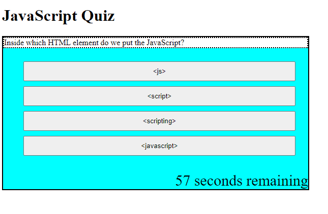

# JavaScript Quiz (2nd Attempt)

https://shanep42.github.io/coding-quiz-2.0/

## Purpose

Within the requirements of the user story, I decided very quickly that a quiz that only presented questions and logged responses with no feedback provided to the user would basically be a glorified form, and not a very interesting one. So, a new question is presented only when the current question is answered **correctly**.

When incorrect choices are selected, the timer is decremented and the wrong option is removed from the list of options. This way, a player actually trying to use this quiz to test their knowledge is aware of whta they got wrong without having to brute force their way through multiple runs of the quiz.

## Challenges

I was in the process of learning new and better ways to do everything involved in this while I was coding it. As a result, I would go back and try to tune things up but ended up mixing and matching new methods and old, and the overall effect was like paving over bad foundations. I learned jQuery, but since the start of the program was not written with jQuery in mind, I was not always successful in tracking down the reason new implementation did not take.

## To Do

I had to resist the urge to scrap everything and start over several times as I learned how poorly I'd arranged things earlier, and not always successfully. If I'd allowed myself more time, I'd have liked to at least clean things up and be a little more uniform in my naming conventions and use of variables.

Styling is barebones to say the least (and extremely ugly and utilitarian to say a bit more), but I was not going to prioritize that while I was not yet fully functional to my satisfaction.

I don't imagine my current quiz has much "replay value", but if I were upgrading everything I'd also shuffle arrays around so that questions and answer options weren't always in the same order.

## Credits

The actual questions come from W3School's JavaScript quiz, paraphrased a few times over as I tried different ways to handle multiple choice formatting.